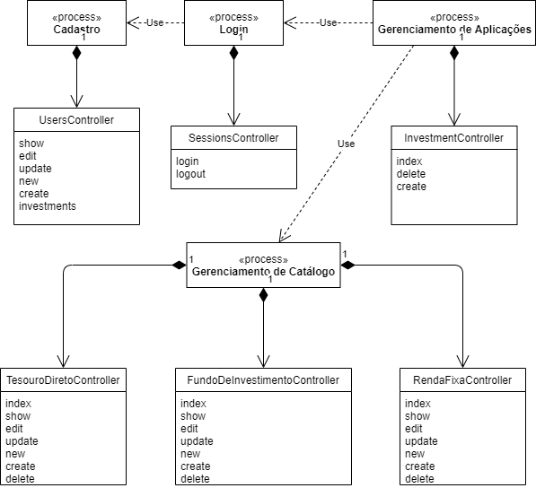
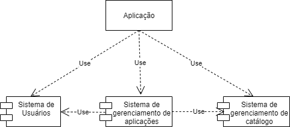

<h1 align="center">Chacão Investimentos</h1>
<h2 align="center">Architecture Notebook</h2>

## 1.Purpose

Este documento fornece uma visão geral da arquitetura abrangente do sistema, usando uma série de views diferentes para descrever diferentes aspectos do sistema. O objetivo é capturar e transmitir as decisões de arquitetura significativas que foram tomadas no sistema.

## 2.Architectural goals and philosophy
O deploy será realizada de forma simples, em somente um servidor, sem processamento paralelo para evitar dessincronização de informações. Como o sistema é financeiro e disponibilizado via web, não será desenvolvido para suportar acesso offline. Os demais requisitos não funcionais foram descritos no documento de Visão.

## 3.Assumptions and dependencies
Será necessário a equipe ter conhecimentos de desenvolvimento no framework web RubyOnRails na sua versão 5. 
É importante também que a equipe tenha conhecimentos de HTML, SCSS e Javascript para lidar com o front-end da aplicação.

## 4.Architecturally significant requirements
- O sistema deve responder em menos de 5 segundos.
- O sistema deve renovar a sessão do usuário a cada login.
- O sistema deve ter o layout responsivo.
- O sistema deve funcionar para os principais navegadores: Google Chrome, Firefox e Safari.
- O sistema deve criptografar as senhas do usuário.

## 5.Decisions, constraints, and justifications
O padrão de arquitetura será MVC, porque utilizaremos o framework de desenvolvimento web RubyOnRails, que tem esse design como paradigma central. Além desse fator o MVC é um dos mais indicados padrões web, tendo em vista que os mais diversos framework web utilizam desse pattern ou de alguma pequena variação dele.

## 6.Architectural Mechanisms
Como utilizaremos o MVC, será destrinchada abaixo, a função da model, view e controller voltadas para o desenvolvimento web.

- Model: Tem a função de comunicar diretamente com o banco de dados e enviar dados para controller quando for requisitado.
- View: Tem a função de mostrar para o usuário as informações com os dados provenientes da controller.
- Controller: Tem a função de tratar os eventos de entradas. No diagrama esse evento é tratado por uma request HTTP como é feito na internet.

## 7.Key abstractions
- Customer: Cliente da aplicação.
- Admin: Administrador da aplicação.
- Catálogo: Listagem do tesouro direto, fundo de investimentos e renda fixa.
- Aplicação: Ação do usuário "comprar" um item do catálogo.

## 8.Layers or architectural framework
Como utilizamos o framework ruby on rails, automaticamente precisamos utilizar o padrão de arquitetura MVC. Dividiremos o sistema em 3 sub-módulos: sistema de cadastro de cliente, 
sistema de gerenciamento de catálogo e o sistema de gerência de aplicações. O Sistema de cadastro de clientes possuirá duas model, uma chamada User e outra chamada Role para armazenar as 
funções do usuário dentro do sistema que no caso serão duas: Customer e Admin, e duas controller: UsersController que será responsável pelo CRUD do usuário e a SessionsController que 
será responsável pela autenticação dos usuários no sistema. Já o sistema de gerenciamento de catálogo possuirá 3 models e 3 controllers com cruds padrões representando o gerenciamento dos itens do
catálogo pelos admins da plataforma. E por último, o subsistema de gerenciamento de aplicações lidará com os investimentos do usuário e se comunicará direto com as models do subsistema de catálogo 
para mostrar as opções disponíveis para compra. Os detalhes da arquitetura serão elucidados no tópico 9.

## 9.Architectural views

### 9.1. Use-case View
Nesse tópico serão mostrados as funcionalidades principais da plataforma em formato de diagrama com use-cases. As funcionalidades principais da plataforma são:
- Login: Essa caso de uso descreve como os usuários podem logar na plataforma
- Gerenciamento de Tesouro Direto: Esse caso de uso permite o administrador da plataforma, criar, editar, deletar e visualizar o tesouro direto no catálogo
- Gerenciamento de Fundos de Investimentos: Esse caso de uso permite o administrador da plataforma, criar, editar, deletar e visualizar os fundos de investimento no catálogo
- Gerenciamento de Renda Fixa: Esse caso de uso permite o administrador da plataforma, criar, editar, deletar e visualizar as rendas fixa no catálogo
- Cadastro: Esse caso de uso permite o usuário comum da plataforma (Customer) à se cadastrar na plataforma informando os dados necessários. O adminstrador será criado diretamente no banco de dados por questões de segurança
- Cadastro de Conta Corrente: Esse caso de uso permite o Customer: anexar uma conta corrente na sua conta da plataforma.
- Gerenciamento de Aplicações: Esse caso de uso permite o Customer: criar, visualizar e cancelar suas aplicações
- Apresentação e edição de dados cadastrais: Esse caso de uso permite o Customer: editar e visualizar seus dados cadastrais
Com dois atores Administrador e Customer.

### 9.1.1 Architecturally-Significant Use Cases 

### 9.2. Process View
Nesse tópico será detalhado os processos dentro da aplicação, focando na responsabilidade de cada objeto e classe para realizar cada tarefa do use-case.

### 9.2.1 Processes

### 9.3. Logical View
Nesse tópico será detalhado os subsistemas dentro da aplicação.

### 9.3.1 Architecture Overview - Susbystem Layering

A aplicação é formada por três subsistemas principais, sendo que o o susbistema de usuários tem a responsabilidade de gerenciamento de usuários e sessions, o sistema de gerenciamento de catálogo 
tem a responsabilidade de gerenciar a disponibilidade de investimentos na plataforma e o sistema de gerenciamento de aplicações, depende dos dois outros sistemas para gerenciar os invesitimentos dos usuários dentro da plataforma.
