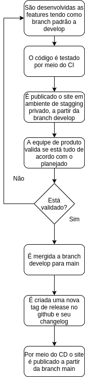

<h1 align="center">Chacão Investimentos</h1>
<h2 align="center">Infrastructure</h2>

## Introdução
O documento de infraestrutura descrevá detalhadamente a rotina necessária para uma nova versão do software ser publicada e disponibilizada ao público.

## Fluxograma
 O fluxograma abaixo representa o procedimento da publicação da plataforma: Primeiro são desenvolvidas as features em branchs saindo da develop, que são mergidas
 posteriormente, quando validadas por meio de testes automatizado utilizando RSPEC, por meio da equipe de projeto com testes manuais e 
 passando por revisões de padrão de código com o rubocop. Logo após a sprint ser finalizada, é realizado o deploy no ambiente de stagging, no qual a equipe não 
 desenvolvedora do projeto, poderá testar as funcionalidades e verificar se está dentro do planejado. Caso as funcionalidades não sejam validadas, elas voltam 
 para o desenvolvimento e caso sejam validadas o processo segue para parte do merge da develop com a main, depois é criada a release no github com o changelog e 
 automaticamente por meio do CD do heroku, o site é disponibilizado ao público.
 
 
 
 ## Especificação técnicas
 - Ambiente de produção e testes: Ubuntu 18 com 512MB de ram
 - Versão do ruby 2.7.2
 - Versão do ruby on rails 6
 - Bibliotecas utilizadas (podem ser encontradas no arquivo Gem.lock)
