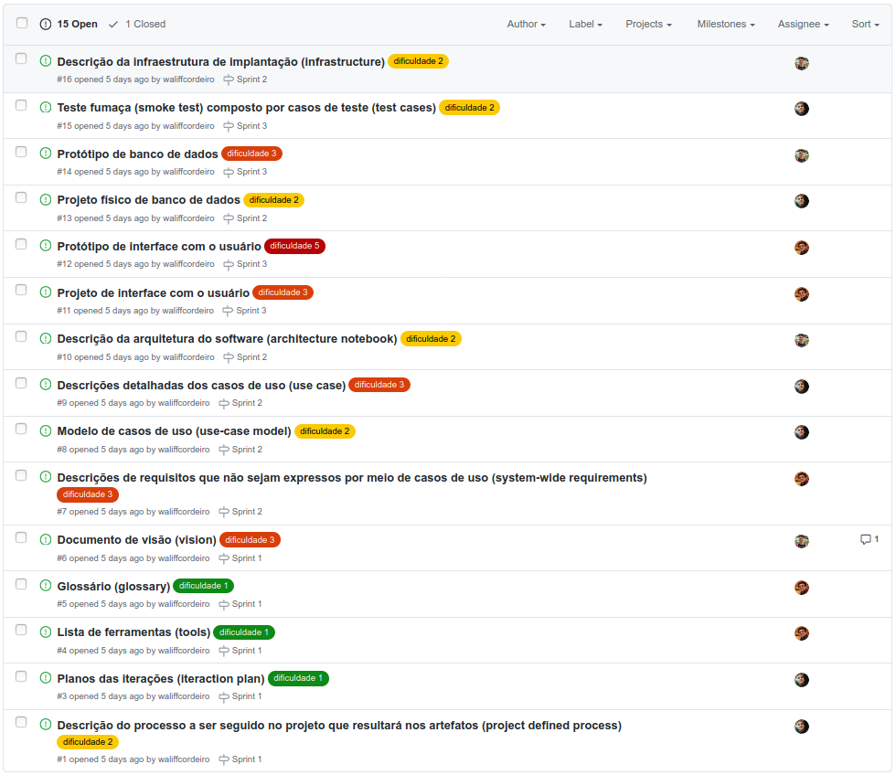

<h1 align="center">Chacão Investimentos</h1>
<h2 align="center">Iteration Plan</h2>

____
#### Introduction
Neste documento você encontrará informações sobre a organização do projeto com foco nas iterações. O projeto está sendo desenvolvido seguindo a metodologia ágil Scrum. O projeto está sendo versionado através do GitHub e utilizados as facilidades de gerência providas por ele para criarmos as Sprints e Milestones.

____
#### 1.  Key milestones
A Start Date da Sprint é o Sprint Planing, feito com uma revisão do Backlog Project, fazendo alguma atualização caso necessário.
A Meeting é nossa reunião após dois dias passados do início da Sprint para avaliarmos o andamento.
A End Date da Sprint é o Sprint Review, feito em reunião com os membros para analisar o desenvolvimento da Sprint e possíveis melhorias para as próximas.
Fora essas datas temos o Daily Scrum que é feito via WhatsApp para uma rápida atualização do trabalho do time no dia em questão.

| Milestone   | Sprint Planing | Meeting    | Sprint Review |
|-------------|----------------| -----------| --------------|
| Sprint 1    | 18/10/2020     | 20/10/2020 | 24/10/2020    |
| Sprint 2    | 25/11/2020     | 27/10/2020 | 30/10/2020    |
| Sprint 3    | 01/11/2020     | 03/11/2020 | 07/11/2020    |
| Sprint 4    | 08/11/2020     | 10/11/2020 | 15/11/2020    |

____
#### 2.  High-level objectives
- Desenvolver artefatos 
- Desenvolver protótipos
- Desenvolver testes
- Desenvolver interface com o usuário
- Revisar o trabalho desenvolvido na Sprint

____
#### 3.  Work Item assignments

| Name or key words of description | Size estimate (points) | Target iteration | Assigned to |
|:--------------------------------:|:----------------------:|:----------------:|:-----------:|
| Planos das iterações (iteraction plan) | 1 | 1 | Waliff |
| Descrição do processo a ser seguido no projeto que resultará nos artefatos (project defined process) | 2 | 1 | Waliff |
| Lista de ferramentas (tools) | 1 | 1 | Emanuel |
| Glossário (glossary) | 1 | 1 | Emanuel |
| Documento de visão (vision) | 3 | 1 | Pedro |
| Projeto físico de banco de dados | 2 | 2 | Waliff |
| Descrição da infraestrutura de implantação (infrastructure) | 2 | 2 | Pedro |
| Descrição da arquitetura do software (architecture notebook) | 2 | 2 | Pedro |
| Descrições detalhadas dos casos de uso (use case) | 3 | 2 | Waliff |
| Modelo de casos de uso (use-case model) | 2 | 2 | Waliff |
| Descrições de requisitos que não sejam expressos por meio de casos de uso (system-wide requirements) | 3 | 2 | Emanuel |
| Teste fumaça (smoke test) composto por casos de teste (test cases) | 2 | 3 | Waliff |
| Protótipo de banco de dados | 3 | 3 | Pedro |
| Protótipo de interface com o usuário | 5 | 3 | Emanuel |
| Projeto de interface com o usuário | 3 | 3 | Emanuel |
| Implementação | 8 | 4 | Todos |

____
#### 4. Issues
| Name or key words of description | Status | Note |
|:--------------------------------:|:------:|:----:|
| Planos das iterações (iteraction plan) | Done |  |
| Descrição do processo a ser seguido no projeto que resultará nos artefatos (project defined process) | Done | |
| Lista de ferramentas (tools) | Done | |
| Glossário (glossary) | Done | |
| Documento de visão (vision) | Done | |
| Projeto físico de banco de dados | Done | |
| Descrição da infraestrutura de implantação (infrastructure) | Done | |
| Descrição da arquitetura do software (architecture notebook) | Done | |
| Descrições detalhadas dos casos de uso (use case) | Done | |
| Modelo de casos de uso (use-case model) | Done | |
| Descrições de requisitos que não sejam expressos por meio de casos de uso (system-wide requirements) | Done | |
| Teste fumaça (smoke test) composto por casos de teste (test cases) | Done |  |
| Protótipo de banco de dados | Done | |
| Protótipo de interface com o usuário | Done | |
| Projeto de interface com o usuário | Done | |
| Implementação | To Do | |

____
#### 5.  Evaluation criteria
- Todos os membros revisarem e aprovarem a issue.
- Passar em 95% dos testes em nível de sistema.
- Resposta favorável pela avaliação do professor da disciplina.
- Concluir o planejamento das iterações sem maiores problemas.

____
#### 6.  Assessment
| Assessment target | Assessment date | Participants | Project status |
|:-----------------:|:---------------:|:------------:|:--------------:|
| Sprint 1          |  24/10/2020     | Emanuel, Pedro e Waliff | Verde   |
| Sprint 2          |  30/10/2020     | Emanuel, Pedro e Waliff | Verde   |
| Sprint 3          |  07/11/2020     | Emanuel, Pedro e Waliff | Verde   |
| Sprint 4          |  15/11/2020     | Emanuel, Pedro e Waliff | Amarelo |

- Assessment against objectives
O projeto seguiu conforme o planejado no plano de iterações. Ao fazer a reunião inicial conseguimos definir bem o que deveria ser feito em cada etapa. Com o sistema de revisões e os prazos a serem seguidos não tivemos maiores problemas.
A parte da implementação contou com pouco tempo mas já era previsto no planejamento pois não consistia no foco do projeto desenvolvido, apesar disso o resultado foi satisfatorio.

- Work Items: Planned compared to actually completed
Todas as issues planejadas foram desenvolvidas, a implementação poderia ter sido melhor realizada mas estava previsto no planejamento de acordo com a deadline.

- Assessment against Evaluation Criteria Test results
O sistema de revisão por parte de todos os membros do grupo foi muito bem sucedido de forma que trouxe bastante segurança no desenvolvimento.
Os testes realizados estiveram dentro da porcentagem ótima de acertos.
O planejamento pôde ser concluído conforme o plano de iterações.
____
#### 7. To Do List
Organizamos nossa Iteration Plan através de um Project no GitHub. Lá fazemos a atualização das issues, as reviews de cada atividade (os dois outros desenvolvedores devem avaliar o trabalho desenvolvido pelo terceiro desenvolvedor para garantir maior qualidade) e acompanhando de forma geral o andamento do projeto.

