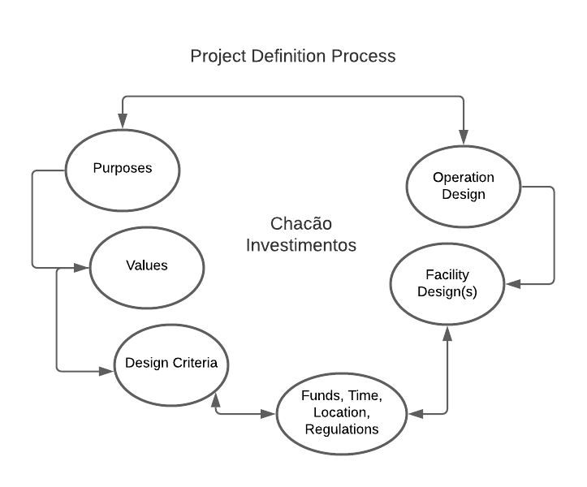

<h1 align="center">Chacão Investimentos</h1>
<h2 align="center">Project Defined Process</h2>

### Introduction
Segundo o guia PMBOK - 4ª Edição, um processo é um conjunto de ações e atividades inter-relacionadas, que são executadas para alcançar um produto, resultado ou serviço predefinido.

No processo do desenvolvimento do sistema Chacão Investimentos definimos utilizar a metodologia ágil Scrum com as adaptações que julgamos necessárias devido o momento de pandemia.

____
#### Purposes
Desenvolver um sistema facilitador de investimentos. A plataforma contará com uma interface intuitiva, possibilitando que usuários que não possuem tanta experiência com a tecnologia e investimentos consigam, ainda assim, utilizá-la sem maiores problemas.
Contará com funcionalidades de gerência dos investimentos feitos, assim como de fato realizar novos investimentos a partir da plataforma.
____
#### Values
A Chacão Investimentos entregará um serviço intuitivo e que abarca usuários de qualquer grupo de renda, ou seja, contará com investimentos desde os mais baixos até os mais altos incentivando o empreendedorismo em nosso país. A contrapartida da empresa será baseada em 5% do lucro dos usuários da plataforma.
____
#### Design Criteria
Por se tratar de uma plataforma de investimento, na qual armazenaremos credenciais de contas bancárias e faremos transações financeiras, não será aceito menos de 100% de acurácia nos testes.
Utilizaremos também o Net Promoter Score (NPS) para acompanhar a satisfação do cliente ao longo do desenvolvimento, de forma que ao entregar cada Sprint iremos coletar o NPS da Sprint e, caso necessário, entender e implementar as melhorias necessárias para aumentar a satisfação dos envolvidos no projeto.
____
#### Operation Design
O projeto será desenvolvido com um Scrum Team de três desenvolvedores, sendo um deles o Scrum Master e o Product Owner.
O desenvolvimento foi subdividido em quatro Sprints, sendo as três primeiras de produção dos artefatos do projeto e a última de implementação, as Sprints contará com comunicação dinâmica via WhatsApp e uma reunião fixa e oficial por Sprint, sendo ela dois dias após o início da mesma.
____
#### Facility Design
O back-end do MVP será desenvolvido utilizando a linguagem Ruby e o framework Ruby on Rails enquanto o front-end será desenvolvido com HTML e CSS.
A hospedagem do MVP será através do Heroku e após melhorias pretende-se adquirir um domínio próprio e migrar para a Digital Ocean, deixando os certificados DNS sob gerência do CloudFlare.
____
#### Funds, Time, Location and Regulation
O financiamento do projeto está sendo feito em maior parte pelo cliente e os desenvolvedores entraram na Chacão Investimentos como sócios fornecendo o conhecimento técnico e horas de serviço como parte da sociedade.
O projeto será desenvolvido em quatro semanas de forma totalmente remota e sem horário fixo de trabalho, sendo que o importante será entregas as issues atribuídas a cada membro ao fim da Sprint, contando com um acompanhamento mútuo do time para que não existam imprevistos.
Para transmitirmos a seriedade, confiança e segurança da Chacão investimentos a corretora de valores na CVM (Comissão de Valores Mobiliários, Lei 6.385/76) e ficará sob supervisão no site do Banco Central para verificar se foi incluída na relação de instituições em funcionamento do país.
Para aumentar a confiabilidade é de interesse da corretora adquirir a certificação CETIP Certifica, além de ficar fiscalizando o site da B3 que organiza e fiscaliza empresas desse ramo.
Outra preocupação da empresa é estar de acordo com a LGPD (Lei Geral de Proteção de Dados Pessoais, Lei nº 13.709/2018) para assegurar aos usuários a confiabilidade do destino das informações fornecidas à empresa. Ou seja, terceiros não terão acesso aos dados pessoais de nenhum usuário da plataforma e a qualquer momento ele pode escolher retirar suas informações de nosso banco de dados.
____

