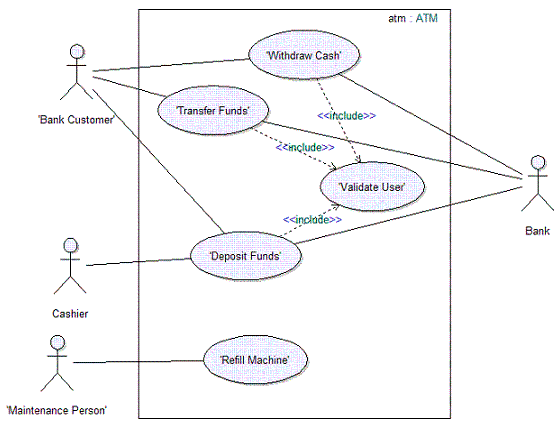
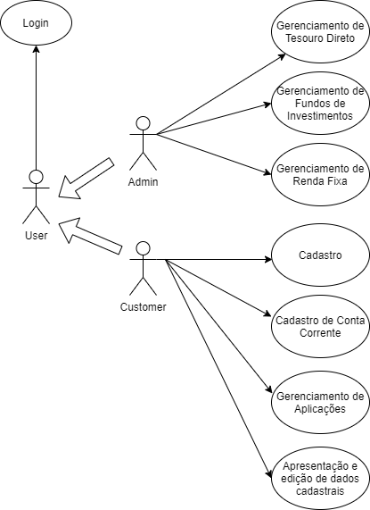

<h1 align="center">Chacão Investimentos</h1>
<h2 align="center">Use-case model</h2>

____
#### Introdução
O modelo de casos de uso identifica um possível modelo das funções desejadas do sistema e de seu ambiente, ele serve também como uma espécie de contrato entre o cliente e os desenvolvedores. O artefato modelo de casos de uso mostra uma visão geral do comportamento esperado do sistema. É a base para o acordo entre os Stakeholders e a equipe do projeto sobre as funcionalidades do sistema. Serve também como um guia para o ciclo de vida de desenvolvimento de software.
O artefato do modelo de casos de uso pode ser customizado para atender as necessidades da equipe. 

De forma geral, o modelo de casos de uso descreve como os diferentes tipos de usuário interagem com o sistema para que determinado problema seja resolvido, ou determinada ação seja executada. Ou seja, ele descreve as metas dos usuários, e as interações entre usuários e sistema bem como o comportamento esperado.
____

#### Propriedades

No nosso modelo de casos de uso iremos explicitar os seguintes elementos:

###### Atores: Contém o nome e uma descrição resumida do ator pois precisamos saber para quem o sistema é.
###### Caso de uso: Nome do caso de uso e especificação e um elemento que o representan.
###### Associações: Descrição de relacionamentos entre os casos de uso e atores.

____
#### Como verificar se o modelo foi bem implementado nos casos de uso?
- É fácil entender o que o sistema faz através da revisão do modelo?  
- Todos os casos de uso foram identificados?  
- O modelo está consistente?  
- Todos os relacionamentos entre os casos de uso são necessários?  
- Os pacotes de caso de uso foram utilizados adequadamente?  
- Todos os elementos de modelo têm nomes adequados?  
- Os casos de uso individuais foram devidamente especificados?  
____
#### Como verificar se o modelo foi bem implementado 
No desenvolvimento do sistema Chacão Investimentos iremos optador por explicitar os casos de uso através de descrições e diagramas que atuem em consonância com as exposições feitas ao longo deste artefato.

Os diagramas seguirão esse exemplo de Diagrama de Caso de Uso disponível no Open Up:

Como explicitado no Open Up:
Este diagrama mostra o assunto (atm:ATM), quatro atores (Cliente, Banco, Caixa e Profissional de Manutenção), cinco casos de uso (Retirar Dinheiro, Transferir Fundos, Depositar Fundos, Recarregar Máquina e Validar Usuário), três dependências <<include>> e as associações entre os atores e os casos de uso.

Os casos de uso Retirar Dinheiro, Depositar Fundos e Transferir Fundos precisam identificar o usuário no sistema. Esse comportamento pode ser extraído para um novo caso de uso incluído chamado Validar Usuário, o qual os três casos de uso básicos incluem. Os casos de uso base são independentes do método utilizado para identificação do usuário, que é encapsulado no caso de uso de inclusão. Do ponto de vista dos casos de uso base, não importa se o método de identificação irá ler um cartão magnético, ou escanear a retina. Eles só dependem do resultado de Validar Usuário.

A figura acima é apenas uma visão parcial do modelo de caso de uso. O modelo completo também inclui as descrições de cada ator, as descrições de cada caso de uso e as especificações para cada caso de uso. 

____
#### Modelo de caso de uso
Tendo o exemplo acima explicitado e trazendo para a realidade da Chacão Investimentos:

____
