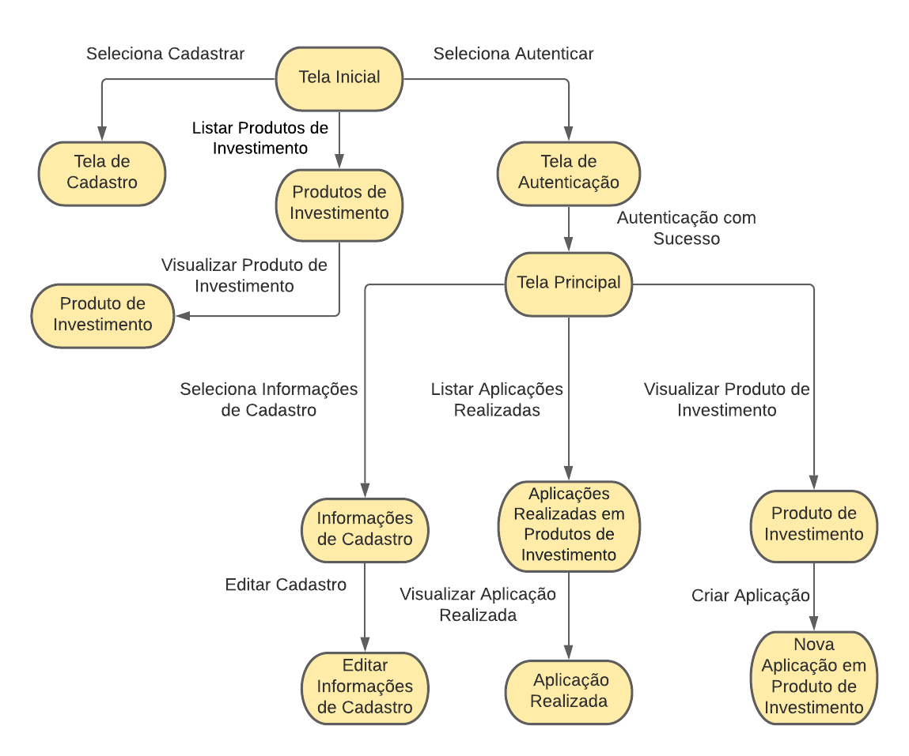
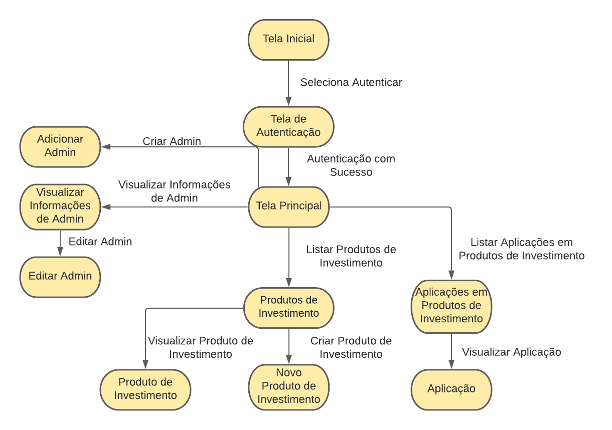

<h1 align="center">Chacão Investimentos</h1>
<h2 align="center">User Interface Design</h2>

____
#### Introdução
O projeto de interface com o usuário descreve através de diagrama as interfaces e também o fluxo de utilização da aplicação por meio das interfaces. Serve também como um guia para prototipagem e implementação das interfaces do sistema.

Nesse artefato serão apresentados dois diagramas que correspondem as interfaces disponíveis aos atores do sistema.

____
#### Diagrama de Interface de Cliente

Diagrama de interfaces disponíveis para cliente da aplicação.

___
#### Diagrama de Interface de Administrador

Diagrama de interfaces disponíveis para administrador da aplicação.

____